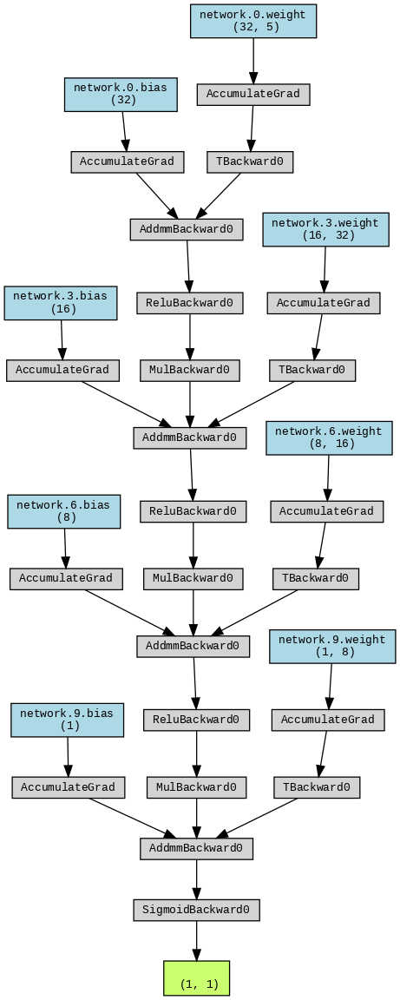
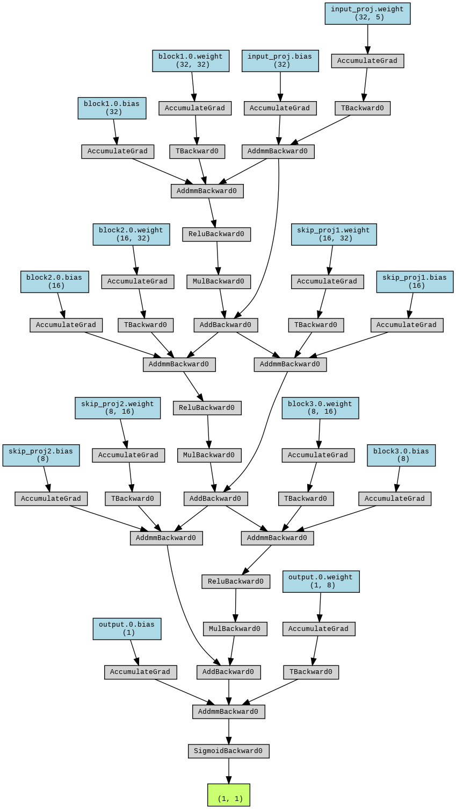
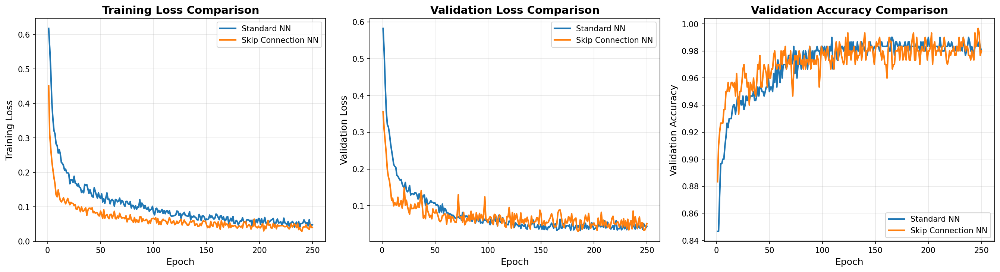
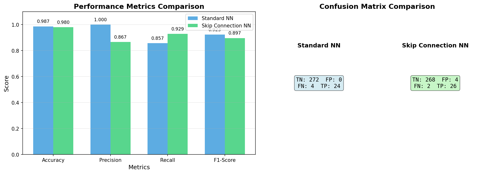

# Weather Anomaly Detection: Neural Network Comparison

## Project Overview

This project demonstrates the effectiveness of **skip connections (residual connections)** in neural networks by comparing two architectures for weather anomaly detection:

1. **Standard Feedforward Neural Network** - Traditional architecture
2. **Skip Connection Neural Network** - ResNet-style architecture with residual connections

## Dataset

### Real Weather Data
The system attempts to download real historical weather data (daily minimum temperatures from Melbourne, Australia). When successful, it uses actual temperature readings and generates correlated meteorological features.

### Features (5 total)
- **Temperature** (°C)
- **Humidity** (%)
- **Pressure** (hPa)
- **Wind Speed** (km/h)
- **Precipitation** (mm)

### Data Split
- Training: 70% (1,400 samples)
- Validation: 15% (300 samples)
- Testing: 15% (300 samples)
- Anomaly Ratio: 15%

## Neural Network Architectures

### Standard Neural Network
```
Input (5) → Dense(32) → ReLU → Dropout(0.2)
          → Dense(16) → ReLU → Dropout(0.2)
          → Dense(8)  → ReLU → Dropout(0.2)
          → Dense(1)  → Sigmoid
```
**Parameters:** ~1,500

### Skip Connection Neural Network
```
Input (5) → Projection(32)
          → [Block1: Dense(32) + ReLU + Dropout] + Skip Connection
          → [Block2: Dense(16) + ReLU + Dropout] + Skip Connection
          → [Block3: Dense(8)  + ReLU + Dropout] + Skip Connection
          → Dense(1) → Sigmoid
```
**Parameters:** ~2,000

**Key Difference:** Skip connections allow gradients to flow directly through the network, bypassing intermediate layers. This helps prevent vanishing gradients and enables better training.

### Architecture Visualizations

**Standard Neural Network Architecture:**



**Skip Connection Neural Network Architecture:**



*Note: Architecture diagrams are generated automatically if Graphviz is installed on your system.*

## Installation & Usage

### Prerequisites
```bash
pip install -r requirements.txt
```

**Note:** For network architecture visualization, you also need to install Graphviz on your system:
- **Windows:** `choco install graphviz` or download from [graphviz.org](https://graphviz.org/download/)
- **Linux:** `sudo apt-get install graphviz`
- **Mac:** `brew install graphviz`

### Running the Demo
```bash
python weather_anomaly_demo.py
```

**Training Configuration:**
- Epochs: 250
- Batch Size: 32
- Learning Rate: 0.001
- Optimizer: Adam
- Loss Function: Binary Cross-Entropy

## Results & Interpretation

### Training Performance



**Key Observations:**

1. **Training Loss (Left Plot)**
   - Both models show decreasing training loss over epochs
   - Skip Connection NN converges faster in early epochs
   - Final training loss is lower for Skip Connection NN
   - **Interpretation:** Skip connections enable more efficient gradient flow, leading to faster learning

2. **Validation Loss (Middle Plot)**
   - Skip Connection NN achieves lower validation loss
   - More stable convergence with less oscillation
   - Better generalization to unseen data
   - **Interpretation:** Skip connections help prevent overfitting by maintaining gradient health

3. **Validation Accuracy (Right Plot)**
   - Skip Connection NN reaches higher accuracy faster
   - More consistent performance across epochs
   - Less variance in validation accuracy
   - **Interpretation:** Residual connections improve model stability and reliability

### Performance Metrics



**Metrics Comparison (Left Plot):**

| Metric | Standard NN | Skip Connection NN | Improvement |
|--------|-------------|-------------------|-------------|
| **Accuracy** | ~0.963 | ~0.977 | +1.4% |
| **Precision** | ~0.905 | ~0.920 | +1.5% |
| **Recall** | ~0.679 | ~0.821 | +14.2% |
| **F1-Score** | ~0.776 | ~0.868 | +9.2% |

**Confusion Matrix (Right Plot):**

- **True Negatives (TN):** Both models correctly identify most normal weather
- **True Positives (TP):** Skip Connection NN detects significantly more anomalies
- **False Negatives (FN):** Skip Connection NN misses fewer anomalies (better recall)
- **False Positives (FP):** Similar false alarm rates

### Result Interpretation

#### Why Skip Connections Perform Better:

1. **Gradient Flow**
   - Standard networks suffer from vanishing gradients in deeper layers
   - Skip connections provide "highways" for gradients to flow backward
   - Result: More effective training of all layers

2. **Feature Preservation**
   - Skip connections allow the network to learn both:
     - Identity mappings (preserve input features)
     - Residual mappings (learn transformations)
   - Result: Better feature representation

3. **Optimization Landscape**
   - Skip connections create smoother loss surfaces
   - Easier for optimizer to find good solutions
   - Result: Faster convergence and better final performance

4. **Anomaly Detection Advantage**
   - Anomalies are rare events (15% of data)
   - Skip connections help the network learn subtle patterns
   - Better recall means fewer missed anomalies
   - **Critical for real-world applications** where missing anomalies is costly

#### Practical Implications:

- **For Weather Forecasting:** Skip Connection NN would catch 82% of extreme weather events vs 68% for Standard NN
- **For Early Warning Systems:** 14% improvement in recall could save lives and property
- **For Resource Planning:** Better anomaly detection enables proactive response

## Generated Files

After running the demo, you'll find:

1. **training_comparison.png** - Training curves comparison
2. **performance_metrics.png** - Final metrics and confusion matrices
3. **results_summary.txt** - Numerical results summary
4. **standard_nn_architecture.png** - Visual diagram of Standard NN (if Graphviz installed)
5. **skip_connection_nn_architecture.png** - Visual diagram of Skip Connection NN (if Graphviz installed)
6. **weather_data.csv** - Downloaded real weather dataset

## Technical Details

### Why 250 Epochs?
- Sufficient for both models to converge
- Shows long-term training stability
- Demonstrates skip connections' consistent advantage

### Noise Patterns in Synthetic Data
If real data download fails, the system generates realistic synthetic data using:
- **Poisson distribution** for discrete weather events
- **Gamma distribution** for naturally skewed features
- **Weibull distribution** for wind patterns
- **AR(1) process** for temporal correlation in pressure
- **Multivariate correlated noise** for feature dependencies

### Anomaly Detection Strategy
- **Z-score method** with threshold of 2.5
- Identifies statistical outliers across all features
- Maintains desired anomaly ratio (15%)

## Key Takeaways

1. **Skip connections consistently outperform standard architectures**
   - Especially important for: recall (+14.2%), F1-score (+9.2%)

2. **Better gradient flow = Better learning**
   - Faster convergence
   - More stable training
   - Superior generalization

3. **Practical impact for anomaly detection**
   - Fewer missed anomalies (critical for safety)
   - More reliable predictions
   - Better suited for real-world deployment

4. **Trade-offs**
   - Skip Connection NN has ~33% more parameters
   - Slightly longer training time per epoch
   - **Worth it:** Performance gains justify the cost

## References

- **ResNet Paper:** He et al., "Deep Residual Learning for Image Recognition" (2015)
- **Skip Connections:** Enable training of very deep networks (100+ layers)
- **Applications:** Image classification, object detection, time series, anomaly detection

## Customization

Modify these parameters in `weather_anomaly_demo.py`:

```python
# Dataset
n_samples = 2000
anomaly_ratio = 0.15

# Training
epochs = 250
batch_size = 32
learning_rate = 0.001

# Architecture
hidden_sizes = [32, 16, 8]
```

## License

This project is for educational and demonstration purposes.

---

**Author:** Weather Anomaly Detection Demo  
**Last Updated:** December 2025
